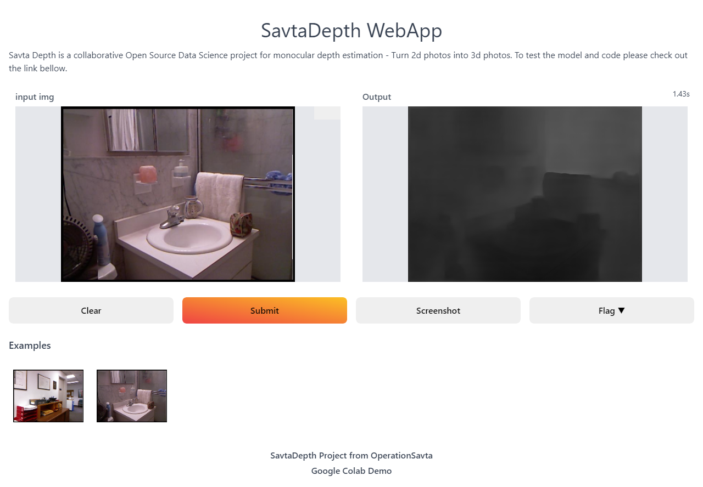
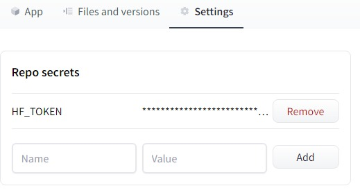

# Savta Depth - Monocular Depth Estimation OSDS Project

Savta Depth is a collaborative *O*pen *S*ource *D*ata *S*cience project for monocular depth estimation.

Here you will find the code for the project, but also the data, models, pipelines and experiments. This means that the project is easily reproducible on any machine, but also that you can contribute data, models, and code to it.

Have a great idea for how to improve the model? Want to add data and metrics to make it more explainable/fair? We'd love to get your help.

## Demo

[](https://colab.research.google.com/drive/1XU4DgQ217_hUMU1dllppeQNw3pTRlHy1?usp=sharing)

**You can use [this notebook](https://colab.research.google.com/drive/1XU4DgQ217_hUMU1dllppeQNw3pTRlHy1?usp=sharing) to load a model from the project and run it on an image you uploaded, to get the depth map. Once it has been saved, you can download it to use on platforms that support it (e.g. Facebook) to create 3d photos.**


## Gradio WebAPP


[SavtaDepth Gradio WebAPP](https://huggingface.co/spaces/kingabzpro/savtadepth)

The web application was developed using the Gradio web framework that comes with powerful features and a user-friendly interface. You can upload the image or use any examples and then submit to see the result. If you see wrong results please flag them, so we can improve the performance.



### Deploy to Hugging Face Space

Before you deploy the app to Hugging Face Spaces, you need to follow a few steps.

1) Create an app by clicking your profile picture on the top right and then selecting `New Space`.


2) Add the name of the app, license information, and select the framework.


3) add remote HF remoted by: `git remote add gradio https://huggingface.co/spaces/kingabzpro/savtadepth`


4) Add metadata on top of your README.md. The metadata contains the app_file directory, license information, and customization.


```yml
---
title: SavtaDepth
emoji: 🛋
colorFrom: gray
colorTo: yellow
sdk: gradio
app_file: app/app_savta.py
pinned: false
license: mit
---
```

5) Rename the gradio_requirements.txt to requirments.txt.

6) The app is using HF flagging function which requirest hugging face token. You need to add token in Repo secret under settings.



7) The last part is pushing the code:

```sheel
git add .
git commit -m "HF deployment"
git push gradio main -f

```

## Contributing Guide

Here we'll list things we want to work on in the project as well as ways to start contributing.
If you'd like to take part, please follow the guide.

### Setting up your environment to contribute

- To get started, fork the repository on DAGsHub
- Now, you have 3 way to set up your environment: Google Colab, local or docker. If you're not sure which one to go with, we recommend using Colab.

#### Google Colab

Google Colab can be looked at as your web connected, GPU powered IDE. Below is a link to a well-documented Colab notebook, that will load the code and data from this repository, enabling you to modify the code and re-run training. Notice that you still need to modify the code within the `src/code/` folder, adding cells should be used only for testing things out.

**You can also use this notebook to load a model from the project and run it on an image you uploaded, to get the depth map. Once it has been saved, you can download it to use on platforms that support it (e.g. Facebook) to create 3d photos.**

In order to edit code files, you must save the notebook to your drive. You can do this by typing `ctrl+s` or `cmd+s` on mac.

\>\> **[SavtaDepth Colab Environment](https://colab.research.google.com/drive/1XU4DgQ217_hUMU1dllppeQNw3pTRlHy1?usp=sharing)** \<\<

**_NOTE: The downside of this method (if you are not familiar with Colab) is that Google Colab will limit the amount of time an instance can be live, so you might be limited in your ability to train models for longer periods of time._**

This notebook is also a part of this project, in case it needs modification, in the `Notebooks` folder. You should not commit your version unless your contribution is an improvement to the environment.

#### Local

- Clone the repository you just forked by typing the following command in your terminal:

  ```bash
  $ git clone https://dagshub.com/<your-dagshub-username>/SavtaDepth.git
  ```

- Create a virtual environment or Conda environment and activate it

  ```bash
  # Create the virtual environment
  $ make env

  # Activate the virtual environment
  # VENV
  $ source env/bin/activate .

  # or Conda
  $ source activate savta_depth
  ```

- Install the required libraries
  ```bash
  $ make load_requirements
  ```
  **_NOTE: Here I assume a setup without GPU. Otherwise, you might need to modify requirements, which is outside the scope of this readme (feel free to contribute to this)._**
- Pull the dvc files to your workspace by typing:

  ```bash
  $ dvc pull -r origin
  $ dvc checkout #use this to get the data, models etc
  ```

- After you are finished your modification, make sure to do the following:

  - If you modified packages, make sure to update the `requirements.txt` file accordingly.

  - Push your code to DAGsHub, and your dvc managed files to your dvc remote. For reference on the commands needed, please refer to the Google Colab notebook section – [Commiting Your Work and Pushing Back to DAGsHub](https://colab.research.google.com/drive/1XU4DgQ217_hUMU1dllppeQNw3pTRlHy1?authuser=1#scrollTo=PAxz-29WhN12&line=1&uniqifier=1).

#### Docker

- Clone the repository you just forked by typing the following command in your terminal:

  ```bash
  $ git clone https://dagshub.com/<your-dagshub-username>/SavtaDepth.git
  ```

- To get your environment up and running docker is the best way to go. We use an instance of [MLWorkspace](https://github.com/ml-tooling/ml-workspace).

  - You can Just run the following commands to get it started.

    ```bash
    $ chmod +x run_dev_env.sh
    $ ./run_dev_env.sh
    ```

  - Open localhost:8080 to see the workspace you have created. You will be asked for a token – enter `dagshub_savta`
  - In the top right you have a menu called `Open Tool`. Click that button and choose terminal (alternatively open VSCode and open terminal there) and type in the following commands to install a virtualenv and dependencies:

    ```bash
    $ make env
    $ source activate savta_depth
    ```

    Now when we have an environment, let's install all of the required libraries.

    **Note**: If you don't have a GPU you will need to install pytorch separately and then run make requirements. You can install pytorch for computers without a gpu with the following command:

    ```bash
    $ conda install pytorch torchvision cpuonly -c pytorch
    ```

    To install the required libraries run the following command:

    ```bash
    $ make load_requirements
    ```

- Pull the dvc files to your workspace by typing:

  ```bash
  $ dvc pull -r dvc-remote
  $ dvc checkout #use this to get the data, models etc
  ```

- After you are finished your modification, make sure to do the following:

  - If you modified packages, make sure to update the `requirements.txt` file accordingly.

  - Push your code to DAGsHub, and your dvc managed files to your dvc remote. For reference on the commands needed, please refer to the Google Colab notebook section – [Commiting Your Work and Pushing Back to DAGsHub](https://colab.research.google.com/drive/1XU4DgQ217_hUMU1dllppeQNw3pTRlHy1?authuser=1#scrollTo=PAxz-29WhN12&line=1&uniqifier=1).

---

### After pushing code and data to DAGsHub

- Create a Pull Request on DAGsHub!
  - Explain what changes you are making.
  - If your changes affect data or models, make sure they are pushed to your DAGsHub dvc remote, and are included in the PR.
  - We will review your contribution ASAP, and merge it or start a discussion if needed.
- 🐶

### TODO:

- [x] Web UI
- [ ] Testing various datasets as basis for training
- [ ] Testing various models for the data
- [ ] Adding qualitative tests for model performance (visually comparing 3d image outputs)
